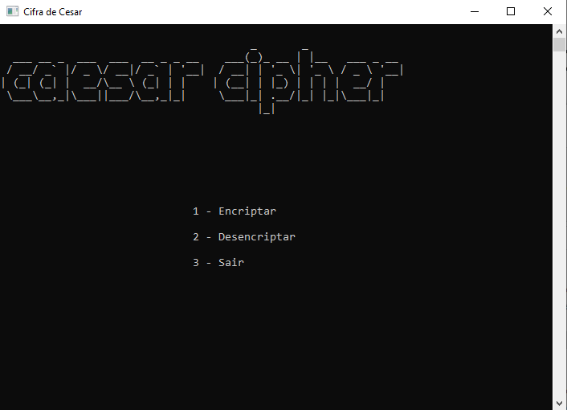
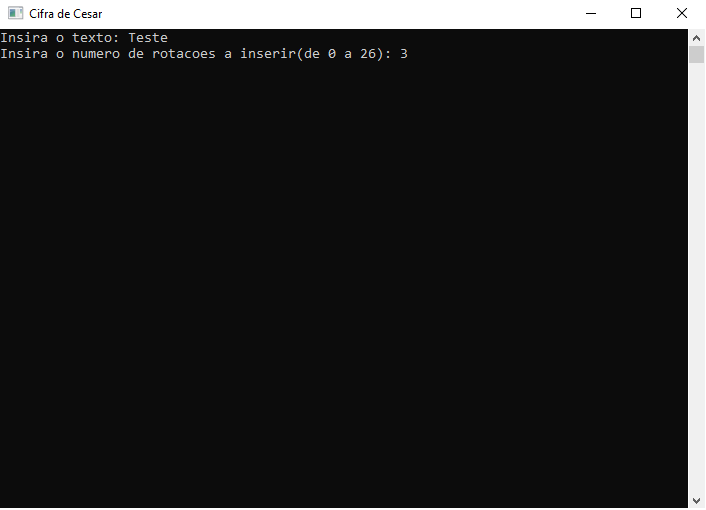
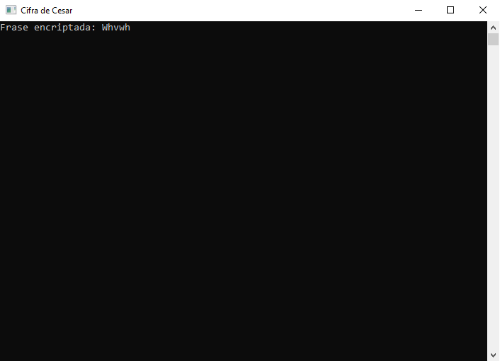
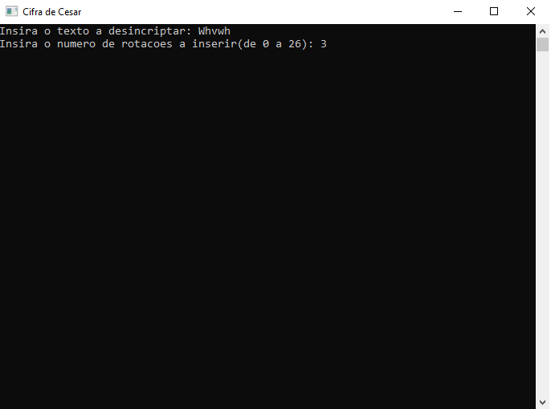

# Caesar_Cipher
A project made in C to encrypt wherever we want using Caesar_Cipher.
This project allow me to learn in a practical way what is the caesar cipher and introduce me to ciphers world.

## Caesar's cipher Explanation
Caesar's cipher is a simple way to encrypt text, which takes the written words and adds a number of rotations (0 to 26), which causes each of the written letters to move in the alphabet the number of rotations chosen (Spaces don't count).  

**Example**:
  * Word: Teste
  * Number of rotation: 3
  * Final Result: Whvwh

## Demonstration
In this program we have a small graphical interface made in the console in order to make the use more pleasant and intuitive for the user.

So taking the example above we encrypt the message "Teste" with 3 rotations

And we get the result: 

When we decrypt the result message with 3 rotations:

We can see that the result is:

